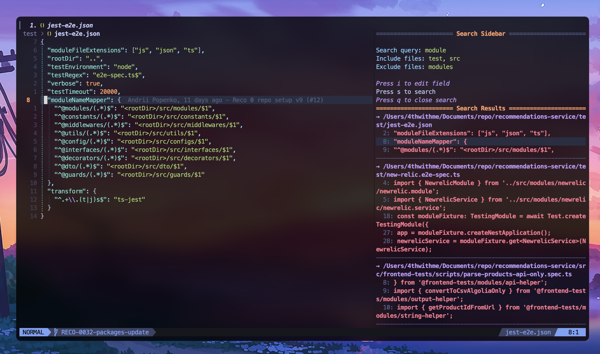

# ss.nvim (Search Sidebar Neovim Plugin)

Search Sidebar Neovim Plugin is a simple and lightweight plugin that provides a sidebar for displaying search results in VSCode-style. It is designed to be easy to use and integrate into your existing Neovim setup.



## Installation

Lazy

```vim
{
  {
    "4thwithme/ss.nvim",
    name = "ss.nvim",
    lazy = false,
    dependencies = {
      "mikew/nvim-drawer"
    },
    config = function()
      require("sidebar").setup({
        width = 60,
        side = "right",
        auto_close = false,
        border = "single",
        title = "Search Sidebar",
      })

      vim.keymap.set("n", "<leader>S", "<cmd>SidebarToggle<CR>", { desc = "Toggle Sidebar" })
    end,
  },
}
```

## Usage

Once installed, you can open the sidebar by running the command:

```bash
<leader>S
```

To close the sidebar, use the command:

```bash
q  or  <leader>S
```

Hover on `Search query:` and press `i` to enter insert mode. Type your search query and press `s` to search. The results will be displayed in the sidebar.

`Include files:` press `i` to enter insert mode and type the file names, or dirrectories you want to include in the search. Press `s` to search.
`Exclude files:` press `i` to enter insert mode and type the file names, or directories you want to exclude in the search. Press `s` to search.

## Example

To quickly toggle the sidebar, you can create a key mapping in your configuration file:

```lua
vim.api.nvim_set_keymap('n', '<leader>S', ':SidebarToggle<CR>', { noremap = true, silent = true })
```

This will allow you to open and close the sidebar using `<leader>S`.
